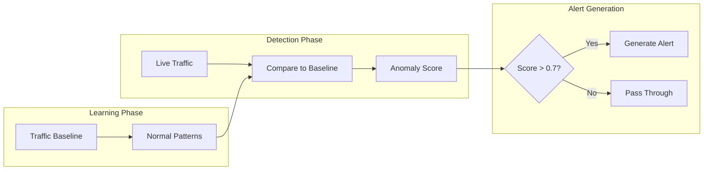
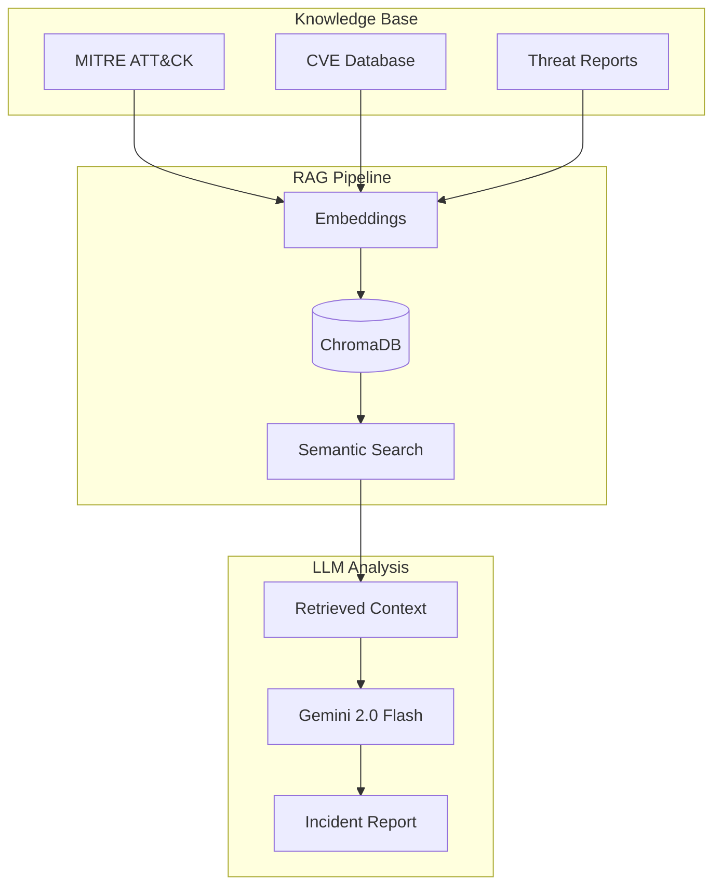
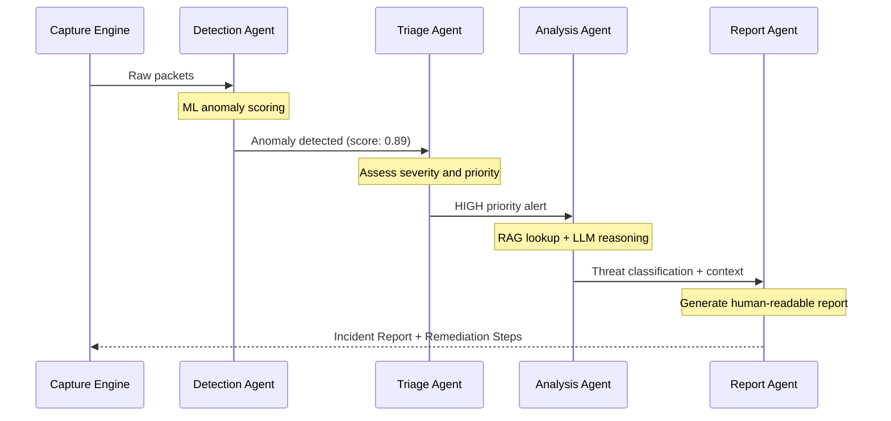
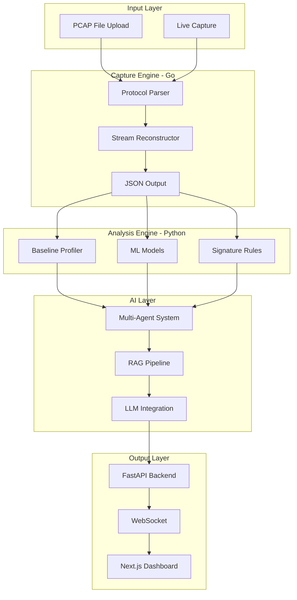
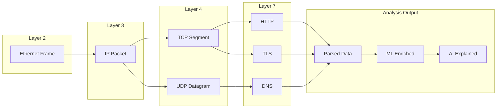

# PacketMind AI

### Intelligent Network Traffic Analyzer

_Deep packet inspection meets generative AI for next-generation threat detection_

[](https://python.org)
[](https://golang.org)
[](https://nextjs.org)
[](LICENSE)

[Features](#features) | [Architecture](#architecture) | [Scenarios](#real-world-scenarios) | [Tech Stack](#tech-stack)

---

## Overview

**PacketMind AI** is an intelligent network security tool that combines deep packet inspection with cutting-edge AI to detect, analyze, and explain network threats in real-time.

Unlike traditional security tools that require manual analysis or expensive enterprise solutions, PacketMind democratizes AI-powered network security by providing:

| Capability                          | Description                                                 |
| ----------------------------------- | ----------------------------------------------------------- |
| **Deep Packet Analysis**            | Parse raw TCP/UDP traffic at the byte level                 |
| **ML-Based Anomaly Detection**      | Learn what "normal" looks like, flag deviations             |
| **LLM-Powered Threat Intelligence** | RAG over MITRE ATT&CK for context-aware analysis            |
| **Multi-Agent SOC**                 | Automated Detection → Triage → Analysis → Response workflow |
| **Real-Time Dashboard**             | Live visualization of network threats                       |

---

## Features

### Deep Packet Inspection

PacketMind captures and analyzes network traffic at the lowest level, parsing raw bytes into structured, meaningful data.

**Data Flow:**

```
Raw Network Packet
┌────────────┬─────────────┬──────────┬─────────────────────┐
│  Ethernet  │  IP Header  │ TCP/UDP  │      Payload        │
│   Frame    │  Src/Dst IP │  Ports   │  Application Data   │
└────────────┴─────────────┴──────────┴─────────────────────┘
                            │
                            ▼
                    Structured Analysis
┌─────────────────────────────────────────────────────────────┐
│  - Protocol identification (HTTP, DNS, TLS, SSH)           │
│  - TCP stream reconstruction                                │
│  - Connection state tracking                                │
│  - Payload extraction and analysis                          │
└─────────────────────────────────────────────────────────────┘
```

| Capability            | Description                                |
| --------------------- | ------------------------------------------ |
| Protocol Parsing      | TCP, UDP, ICMP, DNS, HTTP, TLS metadata    |
| Stream Reconstruction | Reassemble fragmented TCP sessions         |
| Connection Tracking   | Monitor full lifecycle of connections      |
| Payload Analysis      | Extract and analyze application-layer data |

---

### ML-Based Anomaly Detection



| Detection Method    | Attack Type       | Mechanism                                              |
| ------------------- | ----------------- | ------------------------------------------------------ |
| Entropy Analysis    | DNS Tunneling     | High randomness in domain names indicates encoded data |
| Beaconing Detection | C2 Communication  | Regular intervals suggest malware "phoning home"       |
| Volume Anomalies    | DDoS              | Sudden traffic spikes trigger alerts                   |
| Port Scanning       | Reconnaissance    | Rapid connections to multiple ports                    |
| Connection Patterns | Data Exfiltration | Unusual outbound transfer patterns                     |

---

### AI-Powered Threat Intelligence



**Why RAG matters:** LLMs are intelligent but lack specific security knowledge. RAG grounds responses in real threat intelligence, eliminating hallucinations and providing actionable insights.

---

### Multi-Agent SOC Workflow



| Agent           | Responsibility               | Output                                    |
| --------------- | ---------------------------- | ----------------------------------------- |
| Detection Agent | Identify anomalies using ML  | Anomaly score + indicators                |
| Triage Agent    | Prioritize based on severity | Priority level (Critical/High/Medium/Low) |
| Analysis Agent  | Deep investigation with RAG  | Threat classification + MITRE mapping     |
| Report Agent    | Human-readable explanations  | Full incident report with remediation     |

---

## Real-World Scenarios

### Scenario 1: DNS Tunneling Exfiltration

An attacker steals data by encoding it in DNS queries.

**Attack Flow:**

```
Compromised Host                    Attacker's DNS Server
      │                                    │
      │  DNS Query:                        │
      │  "Y3JlZGVudGlhbHM9.evil.xyz"       │
      │────────────────────────────────────>│
      │     (base64 = "credentials=admin:pass")
      │                                    │
      │  DNS Response (acknowledgment)     │
      │<────────────────────────────────────│
      │                                    │
      │  More queries with exfiltrated data│
      │────────────────────────────────────>│
```

**PacketMind Detection:**

```
ANOMALY INDICATORS
━━━━━━━━━━━━━━━━━━━━━━━━━━━━━━━━━━━━━━━━━━━━━━━━━━━━━━━━━━━━━━━━
[!] DNS query length: 67 chars (baseline: 18)
[!] Subdomain entropy: 4.2 bits (baseline: 2.1)
[!] Query frequency: 180/min (baseline: 5/min)
[!] Domain age: 2 days (newly registered)
━━━━━━━━━━━━━━━━━━━━━━━━━━━━━━━━━━━━━━━━━━━━━━━━━━━━━━━━━━━━━━━━
CLASSIFICATION: DNS_EXFILTRATION (91% confidence)
MITRE ATT&CK: T1048.003, T1071.004
```

**Generated Incident Report:**

```
INCIDENT REPORT #2024-0208-001
━━━━━━━━━━━━━━━━━━━━━━━━━━━━━━━━━━━━━━━━━━━━━━━━━━━━━━━━━━━━━━━━

EXECUTIVE SUMMARY
A critical data exfiltration incident has been detected. An attacker
is using DNS tunneling to steal sensitive data including credentials
and financial documents.

ATTACK DETAILS
  Technique:    DNS Tunneling (base64 encoded payloads)
  Source:       192.168.1.55 (FINANCE-LAPTOP-03)
  Destination:  evil-domain.xyz (registered 2 days ago)
  Data Volume:  ~15KB exfiltrated over 7 seconds

IMMEDIATE ACTIONS
  1. Block evil-domain.xyz at DNS/Firewall
  2. Isolate affected host from network
  3. Preserve forensic evidence
  4. Force password reset for exposed credentials
```

---

### Scenario 2: Command and Control Beaconing

Malware on a host communicates with an attacker's server at regular intervals.

**Beaconing Pattern:**

```
Time ─────────────────────────────────────────────────────────>
     │     │     │     │     │     │     │     │     │     │
     ▼     ▼     ▼     ▼     ▼     ▼     ▼     ▼     ▼     ▼
     ●─────●─────●─────●─────●─────●─────●─────●─────●─────●
     └─5m──┘     └─5m──┘     └─5m──┘     └─5m──┘     └─5m──┘

Host: 192.168.1.42 → c2-server.malware.net:443
Interval: 300 seconds ± 10 seconds (jitter)
Payload: Encrypted commands/responses
```

**Detection Logic:**

- Detects periodic connection patterns (humans browse randomly, malware is clockwork)
- Flags connections to low-reputation domains
- MITRE mapping: T1071.001 (Application Layer Protocol: Web Protocols)

---

### Scenario 3: SYN Flood DDoS Attack

Attacker floods a server with TCP SYN packets to exhaust resources.

**Traffic Volume Analysis:**

```
Packets/sec
     ^
50k  │                    ████████████
     │                   ██          ██
40k  │                  ██            ██
     │                 ██              ██
30k  │                ██                ██
     │               ██                  ██
20k  │              ██                    ██
     │             ██                      ██
10k  │   ▁▁▁▁▁▁▁▁██                         ██▁▁▁▁▁▁
     │  ─────────────────────────────────────────────
     └───────────────────────────────────────────────> Time
            Normal    │ ATTACK │  Mitigated

TCP Flags: 100% SYN (no ACK responses)
Source IPs: 10,000+ unique (spoofed)
```

---

## Architecture

### System Overview



### Network Layer Processing



---

## Technical Deep Dive

### TCP Header Structure

```
 0                   1                   2                   3
 0 1 2 3 4 5 6 7 8 9 0 1 2 3 4 5 6 7 8 9 0 1 2 3 4 5 6 7 8 9 0 1
+-+-+-+-+-+-+-+-+-+-+-+-+-+-+-+-+-+-+-+-+-+-+-+-+-+-+-+-+-+-+-+-+
|          Source Port          |       Destination Port        |
+-+-+-+-+-+-+-+-+-+-+-+-+-+-+-+-+-+-+-+-+-+-+-+-+-+-+-+-+-+-+-+-+
|                        Sequence Number                        |
+-+-+-+-+-+-+-+-+-+-+-+-+-+-+-+-+-+-+-+-+-+-+-+-+-+-+-+-+-+-+-+-+
|                    Acknowledgment Number                      |
+-+-+-+-+-+-+-+-+-+-+-+-+-+-+-+-+-+-+-+-+-+-+-+-+-+-+-+-+-+-+-+-+
|Offset | Res.  |U|A|P|R|S|F|          Window Size              |
+-+-+-+-+-+-+-+-+-+-+-+-+-+-+-+-+-+-+-+-+-+-+-+-+-+-+-+-+-+-+-+-+
|           Checksum            |         Urgent Pointer        |
+-+-+-+-+-+-+-+-+-+-+-+-+-+-+-+-+-+-+-+-+-+-+-+-+-+-+-+-+-+-+-+-+
```

**TCP Flags Reference:**

| Flag | Name | Purpose                     |
| ---- | ---- | --------------------------- |
| S    | SYN  | Initiate connection         |
| A    | ACK  | Acknowledge received data   |
| F    | FIN  | Close connection gracefully |
| R    | RST  | Reset/abort connection      |
| P    | PSH  | Push data immediately       |
| U    | URG  | Urgent data present         |

---

### Entropy-Based Detection

Shannon entropy measures randomness in data. Attackers encoding data (base64, encryption) produce high-entropy strings that stand out from normal traffic.

```python
def calculate_entropy(data: str) -> float:
    """
    Calculate Shannon entropy of a string.

    Examples:
        Normal domain:  google.com     -> entropy ~ 2.1
        DNS tunnel:     aHR0cHM...xyz  -> entropy ~ 4.5
    """
    if not data:
        return 0.0

    freq = {}
    for char in data:
        freq[char] = freq.get(char, 0) + 1

    entropy = 0.0
    for count in freq.values():
        prob = count / len(data)
        entropy -= prob * math.log2(prob)

    return entropy
```

**Detection Threshold:** Entropy > 3.5 bits triggers investigation.

---

## Tech Stack

| Component       | Technology            | Purpose                         |
| --------------- | --------------------- | ------------------------------- |
| Packet Capture  | Go + libpcap          | High-performance binary parsing |
| Analysis        | Python + Scikit-learn | ML anomaly detection            |
| Vector Store    | ChromaDB              | Threat intel embeddings         |
| LLM             | Gemini 2.0 Flash      | Natural language analysis       |
| Agent Framework | LangGraph             | Multi-agent orchestration       |
| Backend API     | FastAPI               | REST + WebSocket endpoints      |
| Frontend        | Next.js 14            | Real-time dashboard             |
| Container       | Docker                | Consistent environments         |
| Cloud           | GCP Cloud Run         | Serverless deployment           |

---

## API Reference

### Analyze PCAP File

```http
POST /api/analyze
Content-Type: multipart/form-data
```

**Request:**

```bash
curl -X POST \
  -F "file=@capture.pcap" \
  https://packetmind.example.com/api/analyze
```

**Response:**

```json
{
  "analysis_id": "abc123",
  "packet_count": 15234,
  "duration_seconds": 120,
  "anomalies": [
    {
      "type": "DNS_EXFILTRATION",
      "confidence": 0.91,
      "source_ip": "192.168.1.55",
      "destination": "evil.xyz",
      "mitre": ["T1048.003", "T1071.004"]
    }
  ],
  "report_url": "/reports/abc123"
}
```

### Real-Time Alert Stream

```javascript
// Connect to WebSocket for live alerts
const ws = new WebSocket("wss://packetmind.example.com/ws/alerts");

ws.onmessage = (event) => {
  const alert = JSON.parse(event.data);
  console.log(`[${alert.severity}] ${alert.type}: ${alert.summary}`);
};
```

---

## Use Cases

| User                | Scenario                  | Value Proposition                           |
| ------------------- | ------------------------- | ------------------------------------------- |
| SOC Analyst         | Triage hundreds of alerts | AI prioritization reduces MTTR by 70%       |
| Small Business      | Limited security budget   | Enterprise-grade detection, open source     |
| Security Researcher | Analyze malware samples   | Automated PCAP analysis with MITRE mapping  |
| Network Admin       | Detect policy violations  | Track unauthorized applications/connections |
| Student/Learner     | Understand networking     | Visual packet breakdowns and explanations   |

---

## Roadmap

| Feature              | Status  | Description                                    |
| -------------------- | ------- | ---------------------------------------------- |
| PCAP File Analysis   | Planned | Upload and analyze packet captures             |
| Live Network Capture | Planned | Real-time monitoring mode                      |
| Automated Response   | Future  | Block malicious IPs automatically              |
| Threat Hunting       | Future  | Proactive search with natural language queries |
| SIEM Integration     | Future  | Connectors for Splunk, Elastic                 |

---

## License

MIT License - See [LICENSE](LICENSE) for details.

---

<div align="center">

**Built by [Jagadeep Mamidi](https://github.com/jagadeepmamidi)**

_Democratizing AI-powered network security_

</div>
